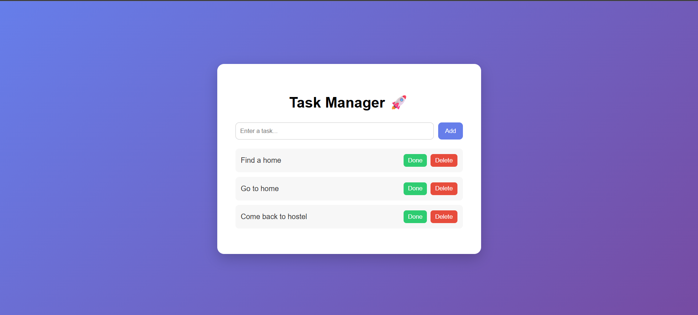

# Task Manager (MERN Stack)

A simple full-stack Task Manager application built with the MERN stack.

## Tech Stack

Frontend
React.js

Backend
Node.js
Express.js

Database
MongoDB Atlas

## Features

* Add tasks
* Delete tasks
* Mark tasks as complete
* Store tasks in MongoDB
* Full CRUD functionality

## Project Structure

task-manager
client → React frontend
server → Node/Express backend

## Installation

Clone the repository

```
git clone https://github.com/YOUR_USERNAME/task-manager.git
```

Install backend dependencies

```
cd server
npm install
```

Install frontend dependencies

```
cd client
npm install
```

Run backend

```
cd server
nodemon server.js
```

Run frontend

```
cd client
npm start
```

## Screenshot



## Future Improvements

* Authentication (login/signup)
* Drag and drop tasks
* Deploy online
* Mobile responsive UI
